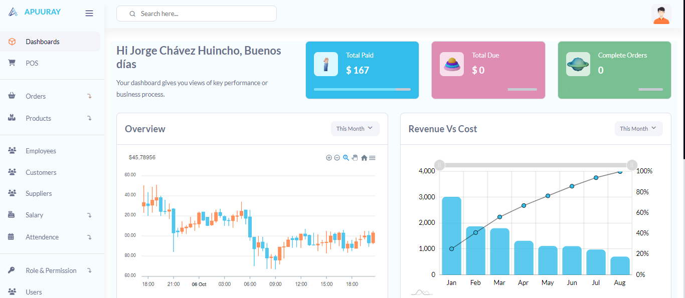

## SISTEMA DE PUNTO DE VENTA CON LARAVEL

Gestión de Punto de Venta y Facturación construido con Laravel 10 y MySql.



## 😎 Características
- POS
- Órdenes
  - Órdenes Pendientes
  - Órdenes Completas
  - Pendiente de Pago
- Gestión de Inventario
- Productos
  - Productos
  - Categorías
- Empleados
- Clientes
- Proveedores
- Salario
  - Adelanto de Salario
  - Pago de Salario
  - Historial de Pagos de Salario
- Asistencia
- Rol y Permiso
- Gestión de Usuarios
- Copia de Seguridad de la Base de Datos

## 🚀 Cómo Utilizar

1. **Clonar Repositorio o Descargar**

    ```bash
    $ git clone https://github.com/yorchavez9/sistema-de-ventas-laravel.git
    ```

2. **Configuración**
    ```bash
    # Ingresar al repositorio
    $ cd laravel-point-of-sale

    # Instalar dependencias
    $ composer install

    # Abrir con tu editor de texto
    $ code .
    ```

3. **.ENV**

    Renombra o copia el archivo `.env.example` a `.env`
    ```bash
    # Generar clave de la aplicación
    $ php artisan key:generate
    ```

4. **Configuración Personalizada de Faker Locale**

    Para establecer Faker Locale, agrega esta línea de código al final del archivo `.env`.
    ```bash
    # En este caso, el locale está establecido en indonesio

    FAKER_LOCALE="id_ID"
    ```

5. **Configuración de la Base de Datos**

    Configura las credenciales de tu base de datos en tu archivo `.env`.

6. **Seed de la Base de Datos**
    ```bash
    $ php artisan migrate:fresh --seed

    # Nota: Si muestra un error, intenta volver a ejecutar este comando.
    ```

7. **Crear Enlace de Almacenamiento**

    ```bash
    $ php artisan storage:link
    ```

8. **Ejecutar Servidor**

    ```bash
    $ php artisan serve
    ```

9. **Inicio de Sesión**

    Intenta iniciar sesión con el nombre de usuario: `admin` y la contraseña: `password`

## 🚀 Configuración
1. **Configuración del Gráfico**

    Abre el archivo `./config/cart.php`. Puedes establecer impuestos, formato de números, etc.
    > Para más detalles, visita este enlace [hardevine/shoppingcart](https://packagist.org/packages/hardevine/shoppingcart).

2. **Crear Enlace de Almacenamiento**

    ```bash
    $ php artisan storage:link
    ```

3. **Ejecutar Servidor**

    ```bash
    $ php artisan serve
    ```

4. **Inicio de Sesión**

    Intenta iniciar sesión con el nombre de usuario: `admin` y la contraseña: `password`

    o nombre de usuario: `user` y contraseña: `password`

## 📝 Contribuciones

Si tienes alguna idea para hacerlo más interesante, por favor envía un PR o crea un problema para una solicitud de función.

## Contactos:
Correo: djjmygm160399@gmail.com
Whatsapp: +51 920468502